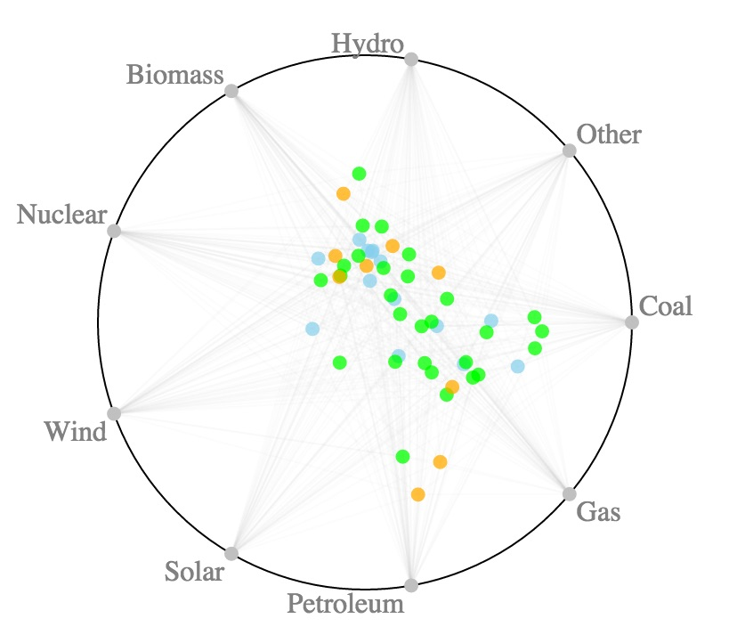

## What is Radviz?

<p align="center">
    
<p>


Here's a definition, taken from [this excellent article](https://www.researchgate.net/profile/Georges_Grinstein/publication/221152759_Dimensional_Anchors_A_Graphic_Primitive_for_Multidimensional_Multivariate_Information_Visualizations/links/02e7e51cc10ff8a1c9000000.pdf):

> Radviz, described in [this article](http://www.cs.uml.edu/~phoffman/dna1/), attaches to each data point fixed springs each of which is also attached at points around a circle. The springs represent dimensions of the data. The data points are displayed at the position where the sum of the spring forces is zero. The spring force K for each spring is the value of the data point for that dimension.

## Examples

Let's try a few examples, from the /example folder:

* [Energy production in the U.S.](http://biovisualize.github.io/radviz/example/energy.html) shows basic features, styling and events (in the console and linked bar chart)
* [Iris dataset](http://biovisualize.github.io/radviz/example/iris.html) shows the fancy useRepulsion in action

You can also try it live on [Blockbuilder](http://blockbuilder.org/biovisualize/a91f514aaf57eabf8e36)

## Minimal Documentation

Simply add the compiled version to your HTML:
```html
<script src="../radviz-min.js"></script>
```
And use it like this:
```javascript
var data = [
    {"sepalLength": 5.1, "sepalWidth": 3.5, "petalLength": 1.4, "petalWidth": 0.2, "species": "setosa"},
    {"sepalLength": 4.9, "sepalWidth": 3.0, "petalLength": 1.4, "petalWidth": 0.2, "species": "setosa"},
    {"sepalLength": 4.7, "sepalWidth": 3.2, "petalLength": 1.3, "petalWidth": 0.2, "species": "setosa"},
    {"sepalLength": 4.6, "sepalWidth": 3.1, "petalLength": 1.5, "petalWidth": 0.2, "species": "setosa"}
];

var radviz = radvizComponent()
    .config({
        el: document.querySelector('.container'), // container node or selector
        size: 400, // size of the whole SVG
        margin: 50, // margin around the circular panel, to leave some room for the labels
        dimensions: ['sepalLength', 'sepalWidth', 'petalLength', 'petalWidth'], // data keys to use as dimensions
        useTooltip: true, // a simple tooltip component is provided
        tooltipFormatter: function(d){ return d.foo; }, // the datum for the hovered node is given as argument
        colorAccessor: function(d){ return d['species']; }, // dimension to use for coloring
        colorScale: d3.scale.ordinal().range(['skyblue', 'orange', 'lime']), // color palette
        drawLinks: true, // wether to draw links or not
        zoomFactor: 1, // gets the dimension nodes on a bigger radius than the panel, to pull nodes away from the center
        dotRadius: 4, // radius of each dot
        useRepulsion: false // special repulsion effect to spread the nodes from each others so they can be better selected
    })
    .on('panelEnter', function() {
        // mouse entered the circular panel
    })
    .on('panelLeave', function() {
        // mouse left the circular panel
    })
    .on('dotEnter', function() {
        // mouse entered a dot
    })
    .on('dotLeave', function() {
        // mouse left a dot
    })
    .render(data);
```
